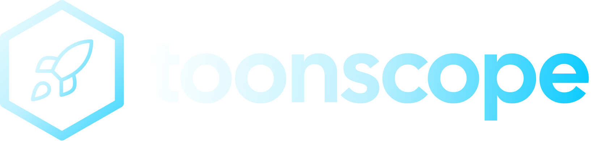

<div align="center">

<h1>
  <picture>
    <source media="(prefers-color-scheme: dark)" srcset="assets/subtitle.png">
    
  </picture>
</h1>

**Turn codebases into token-efficient YAML summaries for AI agents.**

[](https://www.npmjs.com/package/toonscope)
[](LICENSE)
[](package.json)

</div>

---

ToonScope compiles your codebase into a small set of YAML files that an AI
coding agent can read instead of your full source tree. Point your agent at
`.toon/` and it gets exports, function signatures, types, and the import
graph for every file, without paging through raw source for context it
doesn't need.

## Get started in 60 seconds

```bash
npx toonscope init
```

That single command detects your project, writes `.toonscope.yaml`, wires
up AGENTS.md (and CLAUDE.md, Cursor, Copilot, Gemini, or Windsurf if it
finds them), and runs the first build for you. A few yes/no prompts along
the way are all skippable with sane defaults, so hitting enter through them
is a perfectly good choice. From then on, your agent picks up `.toon/`
automatically.

Made a change and want the map to catch up?

```bash
npx toonscope generate
```

Or keep it live while you work:

```bash
npx toonscope watch
```

That's really it. Everything past this point is detail for when you want
to tune something.

## Why it's worth doing

Say an agent asks "what does `src/config.ts` export, and what calls it?"
It doesn't need the whole file, just the exports, the function signatures,
and the import graph. On this repo, `src/config.ts` is 586 tokens of
TypeScript, and its ToonScope YAML is 200 tokens that answer exactly that
question. `src/cli.ts`, the largest file here at 8,184 tokens, compacts
down to 787. Across this whole project (38 files), raw source is about
52,150 tokens, and the full `.toon/` output is about 18,000: roughly a 65%
reduction, measured with `npx toonscope stats`, not estimated.

ToonScope gets there with static analysis (tree-sitter WASM grammars), not
an LLM, so it's fast, deterministic, and free by default. An LLM step is
optional, and it just makes the prose summaries nicer to read.

## Trusting the map

An index that quietly drifts from your source is worse than no index at
all, so ToonScope gives you a way to check:

```bash
npx toonscope check
```

This compares content hashes against your source with no rebuild involved.
It exits clean when `.toon/` is current, and otherwise tells you exactly
which files are new, changed, or removed. Agents set up by `init` are
instructed to run this before trusting the map, so a stale index gets
caught rather than silently fed into a prompt.

## Staying in sync

Two opt-in ways to avoid having to remember `toonscope generate` yourself,
both offered by `init` (and available any time after):

- **Pre-commit hook** — `toonscope hook install` adds a git `pre-commit`
  hook that runs `check`, and on a stale result runs `generate` and
  `git add .toon` before the commit lands. It never blocks a commit (a
  missing `npx`/network hiccup just no-ops) and composes with an existing
  hook file — including Husky — instead of overwriting it. Remove it with
  `toonscope hook remove`.
- **Agent instruction** — answering yes to "Tell AI agents to run
  `toonscope generate` after finishing a change?" during `init` (or setting
  `integrations.agentAutoUpdate: true` in `.toonscope.yaml`) adds one line
  to the generated AGENTS.md/CLAUDE.md/etc. telling the agent to run plain
  `toonscope generate` — never `--summarize` — once it's done editing, so
  it costs no LLM tokens either way.

## AI summaries (optional)

By default every file gets a deterministic, templated one-line summary
("Module exporting `foo`, `bar`."), derived purely from static analysis, no
API key and no network call needed. If you'd rather have readable prose
summaries, an LLM can generate them instead:

```bash
npx toonscope key set google      # or: anthropic, openai, mistral. Stores the key at
                                   # ~/.config/toonscope/config.json, never in the repo
npx toonscope generate --summarize
```

| Provider    | Env var(s)                          | Default model          |
| ----------- | ----------------------------------- | ---------------------- |
| `google`    | `GEMINI_API_KEY` / `GOOGLE_API_KEY` | `gemini-2.5-flash`     |
| `anthropic` | `ANTHROPIC_API_KEY`                 | `claude-haiku-4-5`     |
| `openai`    | `OPENAI_API_KEY`                    | `gpt-4.1-mini`         |
| `mistral`   | `MISTRAL_API_KEY`                   | `mistral-small-latest` |
| `ollama`    | _(none, runs locally)_              | `llama3.2`             |

Key resolution order: `--api-key` flag, then a provider env var (or the
generic `TOONSCOPE_API_KEY`), then `toonscope key set` (user-level config),
then `ai.apiKey` in `.toonscope.yaml` (discouraged; a warning is printed if
used). AI summaries are cached per file content hash and provider/model,
and a provider failure on one file never aborts the run. It just keeps
that file's template summary.

## Commands

| Command                                        | What it does                                                                                                                                                                                                                                           |
| ---------------------------------------------- | ------------------------------------------------------------------------------------------------------------------------------------------------------------------------------------------------------------------------------------------------------ |
| `toonscope init`                               | Detect the project, write `.toonscope.yaml`, optionally configure AI summaries and integration files, optionally run the first `generate`.                                                                                                             |
| `toonscope generate`                           | Analyze the codebase and write `.toon/`. Incremental by default (reuses `.toon/cache.json` for unchanged files); `--force` for a full rebuild. `--summarize` enables AI summaries; `--vault <path>` also writes a memory file for tools that read one. |
| `toonscope check`                              | Verify `.toon/` is current against source, no rebuild, just a content-hash comparison. Exits 0 when up to date, 1 (with a list of stale/new/removed files) otherwise. This is what agents are instructed to run before trusting `.toon/`.              |
| `toonscope scope <file> --depth 2`             | Print (or `--out` a file with) a merged YAML view of one file plus its dependency neighbors out to `--depth` hops, useful for a focused read without the whole `.toon/` tree.                                                                          |
| `toonscope stats`                              | Print raw vs. compressed token counts and the reduction percentage.                                                                                                                                                                                    |
| `toonscope watch`                              | Rebuild `.toon/` incrementally as files change.                                                                                                                                                                                                        |
| `toonscope clean`                              | Remove `.toon/` (keeps `.toonscope.yaml`). `--integrations` also strips the managed blocks from AGENTS.md/etc. and deletes the generated cursor/windsurf rule files.                                                                                   |
| `toonscope hook install / remove / status`     | Manage a git `pre-commit` hook that runs `check` and, if stale, `generate` + `git add .toon` before each commit — never blocks the commit, just keeps the map from drifting. Composes with existing hooks (Husky-aware) instead of overwriting them.   |
| `toonscope key set / list / remove <provider>` | Manage stored AI provider API keys.                                                                                                                                                                                                                    |

Every command accepts `--quiet` (essentials only), `--json` (machine
readable output), and `--no-color`.

## Config reference (`.toonscope.yaml`)

```yaml
include: [src] # source roots to scan
exclude: ["**/node_modules/**", "**/dist/**", ...] # glob excludes (junk dirs excluded by default)
output: .toon # output directory
defaultDepth: 2 # default `scope` BFS depth
languages: [typescript, javascript, python] # which analyzers run
splitThreshold: 15 # a directory with more files than this gets its own index/*.yaml sub-index
gitignoreToon: true # `init` ensures /.toon/ is gitignored when true; other commands never touch .gitignore
ai: # omit entirely to use only template summaries
  provider: google # google | anthropic | openai | ollama | mistral
  model: gemini-2.5-flash # optional override
  concurrency: 8 # optional, parallel summarization requests
  ollamaUrl: http://localhost:11434 # ollama only
integrations:
  agents: true # AGENTS.md, always on by default
  claude_code: false # CLAUDE.md
  cursor: false # .cursor/rules/toonscope.mdc
  copilot: false # .github/copilot-instructions.md
  gemini: false # GEMINI.md
  windsurf: false # .windsurf/rules/toonscope.md
  agentAutoUpdate: false # add a line telling agents to run `generate` after finishing a change
precommitHook: false # whether `init`/`hook install` installed the pre-commit hook
```

`init` fills in `include`/`languages` from what it actually finds on disk
(a monorepo with `app/`, `server/`, and `shared/` directories gets all
three, for example), and `integrations` from which AI tool configs it
detects. You're asked before anything is written.

## Output format

```
.toon/
  index.yaml          # every file: type, one-line summary, exports, connection counts
  index/*.yaml         #   ...split into per-directory sub-indexes once a dir exceeds splitThreshold files
  graph.yaml           # import / imported_by edges + directory clusters
  types.yaml            # type definitions shared across 2+ files
  files/<path>.yaml     # per-file detail (see below)
  scopes/<file>.yaml    # cached output of the last `scope` run for that file
  cache.json             # internal, content-hash cache for incremental generate
```

A real per-file YAML from this repo (`.toon/files/src/config.ts.yaml`,
generated from `src/config.ts`, 586 raw tokens down to 200 here):

```yaml
path: src/config.ts
type: config
summary: Configuration module exporting DEFAULT_CONFIG, resolveProjectRoot, loadConfig, saveConfig.
exports:
  constants: [DEFAULT_CONFIG]
  functions: [resolveProjectRoot, loadConfig, saveConfig]
imports:
  local:
    - path: src/types.ts
      names: [ToonConfig]
  external:
    - source: node:fs
      names: [fs]
    - source: node:path
      names: [path]
    - source: yaml
      names: [parseyaml, stringifyyaml]
functions:
  loadConfig: "loadConfig(projectRoot: string, configPath: string?) => ToonConfig"
  resolveProjectRoot: "resolveProjectRoot(startDir: string) => string"
  saveConfig: "saveConfig(projectRoot: string, config: ToonConfig, configPath: string?) => string"
uses: [src/types.ts]
used_by: [src/cli.ts]
```

Every function/method signature is captured with typed params, return
type, and its doc comment's first line (JSDoc/docstring), not just names.
That's usually enough for an agent to decide whether it needs to open the
real file at all.

## Languages supported

TypeScript, JavaScript (including JSX/TSX), Python, Go, and Rust, with
more planned. Import resolution follows relative paths and
tsconfig/jsconfig `paths` aliases for TS/JS (nearest
`tsconfig.json`/`jsconfig.json` walking up from each file), and Rust's
`crate::`/`self::`/`super::` paths for same-crate resolution.

## Performance

Measured, not estimated: two data points, one small and one large.

**This repo** (38 files): raw source ~52,150 tokens down to `.toon/`
~18,000 tokens, a 65% reduction (`npx toonscope stats`).

**A 968-file real-world monorepo** (Next.js app + Node server + shared
TypeScript packages, several `tsconfig.json`s with path aliases):

|                                            |                              |
| ------------------------------------------ | ---------------------------- |
| Files analyzed                             | 968                          |
| Cold `generate` (no cache)                 | 15.1s                        |
| Warm `generate` (nothing changed)          | 6.8s (~2x faster)            |
| Parse phase, cold to warm                  | 5.8s to 0.3s (~19x faster)   |
| Token reduction                            | 49.1% (1.92M to 975K tokens) |
| Peak memory                                | 134.5 MB                     |
| Parse errors                               | 0                            |
| `@/`- and workspace-alias imports resolved | all of them                  |

## Large-repo notes

- `generate` is incremental: a file is only re-parsed when its content hash
  or the analyzer version changes; AI summaries are cached separately by
  content hash and provider/model. Use `--force` to bypass the cache; this
  is what drives the cold/warm gap above.
- Directories with more files than `splitThreshold` get a per-directory
  sub-index under `index/` instead of inlining every file into
  `index.yaml`, so the "always read" files stay small even in a large repo.
- `graph.yaml` and `types.yaml` also split into a `.full.yaml` companion
  once they'd otherwise get large, keeping the primary file focused on the
  most-connected edges/types.
- A file that fails to parse is skipped with a warning, not fatal to the
  run. The failure count is reported at the end.
- All output paths use forward slashes, including on Windows.

## Contributing

Bug reports, feature ideas, and pull requests are all welcome. See
[CONTRIBUTING.md](CONTRIBUTING.md) for how to get a dev environment running
and what to know before opening a PR.

## License

AGPL-3.0-only. See [LICENSE](LICENSE).
